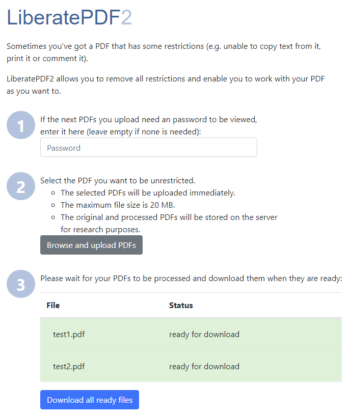

# LiberatePDF 2

LiberatePDF2 is a frontend for OpenPDF (fork of iText) or PDFtk (which uses iText) to remove the PDF encryption and all restrictions (e.g. printing disabled, commenting disabled, et cetera).

## Architecture

The frontend is made with Angular. It connects to a REST backend written in Kotlin and the Micronaut framework.

## Build

The simplest method would be starting the `docker-compose.yml` with `docker-compose up --build` which spins up a Nginx container at `http://localhost:8082` which serves the angular client, and the REST backend container at `http://localhost:8081`.

For building the angular client and the REST service without Docker, see the `README.md` in their subdirectories.

## Configuration

Main settings which can be configured are described in `docker-compose.yml`.
